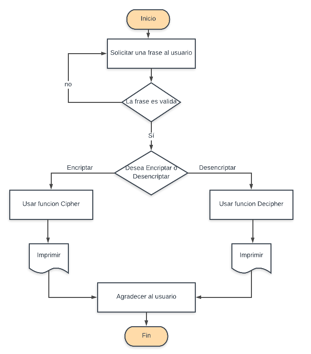

#  CIFRADO CESAR

#### PLANTEAMIENTO:

###### Crearemos una web que pida una frase al usuario, la manipulara y regresara el mismo mensaje pero esta vez encriptado segun el algoritmo del cifrado cesar.

###### Para esta caso en especial usaremos un algoritmo de cifrado Cesar con un parametro de 33 espacios a la derecha.

##### Por ejemplo:

Si nuestro texto original es:
  ABCDEFGHIJKLMNOPQRSTUVWXYZ

Nuestra web debera regresar:
   HIJKLMNOPQRSTUVWXYZABCDEFG

#### PSEUDOCODIGO:
##### Descripcion.
###### En esta parte se decribe la funcionalidad del proyecto descrito en pasos simples.

1.- Se solicita al usuario la frase a encriptar.

2.- Se validaran los datos del usuario para evitar numeros y cadenas vacias.

3.- Se le pregunta al usuario si desea cifrar o decifrar su frase.

4.- Por medio de las funciones Cipher y Decipher se manipulara la frase asignandole sus nuevos caracteres, conforme a la eleccion del usuario.

5.- Se imprimira el nuevo valor de la frase para el usuario.

#### DIAGRAMA DE FLUJO :
##### Descripcion.
###### Este sera el Flujo a seguir de nuestro programa.

